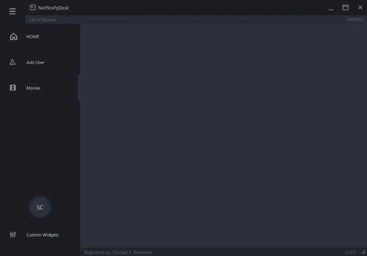
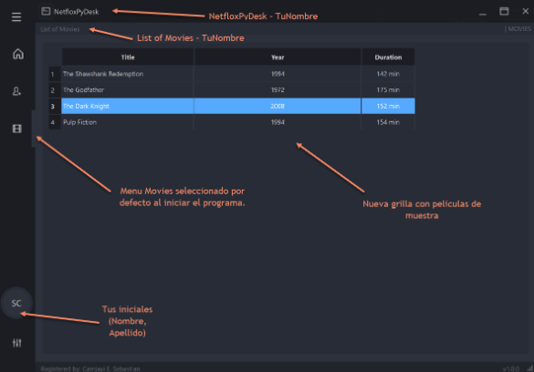

# UIXCore - Desk Template - PyQt6(Migrado) (MODERN / FLAT GUI)

> **Warning**: use PyQt6 > PyQt6-6.8.1 PyQt6-Qt6-6.8.2 PyQt6-sip-13.10.0 (**pip install PyQt6**)!


Proyecto creado utilizando Python, Qt Designer y PyQt6.
Espero que sea de ayuda para todos los que están comenzando en el mundo de Python.
Este proyecto funciona muy bien en Windows; sin embargo, en Linux y macOS hay algunos problemas con el tamaño de las fuentes y la barra de título personalizada no funciona correctamente.

## REQUERIMENTS

>
> ```sh
> python -m venv env
> .\env\Scripts\Activate
> pip install PyQt6
> ```
>

## RUN FILE

main.py

## ADD MENUS


### Historia de Usuario
Como usuario,  
quiero que la aplicación **NetfloxPyDesk** tenga ajustes iniciales en el archivo principal (main.py) que incluyan la incorporación del nuevo menú "Movies",  
para mejorar la navegación y ampliar las opciones disponibles en la interfaz, aprovechando la flexibilidad de **PyQt6**.



### 🎯 Estimación:
🕒 **Esfuerzo estimado:** 5 puntos de historia  
👕 **Tamaño:** Mediano (M)

### 🔗 Dependencias:
- Acceso al repositorio en GitHub.
- Configuración inicial de Python 3.12 instalada en los entornos de desarrollo.
- Integración de la librería **PyQt6** y módulos del template **uixcore**.

### 📅 Fecha Límite:
⏳ **Fecha estimada de finalización:** 26 de junio de 2025  
👤 **Responsable:** @Ancianoxd 

### 🏆 Sprint / Milestone:
📌 **Sprint:** Sprint 2 - Configuración y ajustes iniciales  
🏁 **Milestone:** Versión 0.2 - Ajustes en main.py y Menú Movies

### ✅ Definición de Hecho:
- [x] Se han implementado menús dinámicos que incluyen las secciones **HOME**, **Add User**, **Custom Widgets** y la nueva sección **Movies**.
- [x] La sección **Movies** se visualiza correctamente, mostrando un widget vacío preparado para futuras funcionalidades.
- [x] Se han realizado ajustes en el archivo main.py, incluyendo la actualización del título a **NetfloxPyDesk** y el tamaño de la ventana a `1024x720`.
- [x] La aplicación se ejecuta sin errores con `python main.py`.
- [x] El código está versionado en GitHub (`main`).
- [x] Se ha documentado la estructura y los cambios en el README.
- [x] Se ha realizado una revisión de código interna.

### 📌 Tareas:
- [x] Agregar el repositorio remoto en GitHub.
- [x] Incorporar y actualizar los archivos del template **uixcore** con los nuevos cambios.
- [x] Realizar el commit con el mensaje "Ajustes Iniciales main - Menu Movies #2" que incluya los ajustes iniciales y la nueva funcionalidad.
- [x] Hacer el primer push a la rama `main`.

    ```bash
    # Configurar la URL remota (reemplazar 'tu-usuario' por el nombre de usuario real)
    git remote add origin https://github.com/tu-usuario/netfloxpydesk.git

    # Agregar todos los cambios al área de preparación
    git add .

    # Realizar el commit con el mensaje correspondiente (en este ejemplo, el Item #26)
    git commit -m "Ajustes Iniciales main - Menu Movies #26"

    # Renombrar la rama actual a main (si es necesario)
    git branch -M main

    # Subir los cambios al repositorio remoto y establecer la rama principal
    git push -u origin main

### 🔗 Referencias:
🔹 **Commit:** [Ajustes Iniciales main - Menú Movies #2](https://github.com/tu-usuario/netfloxpydesk/commit/hash)  
🔹 **Repositorio:** [GitHub - NetfloxPyDesk](https://github.com/tu-usuario/netfloxpydesk)

### Historia de Usuario
Como usuario,  
quiero visualizar un listado de películas en una pantalla exclusiva al hacer clic en el menú "Movies",  
para ver de forma clara y ordenada la información básica de las películas (Título, Año y Duración) sin distracciones adicionales, aprovechando un estilo dark moderno.



### 🎯 Estimación:
🕒 **Esfuerzo estimado:** 3 puntos de historia  
👕 **Tamaño:** Pequeño (S)

### 🔗 Dependencias:
- Acceso al repositorio en GitHub.
- Configuración inicial de Python 3.12 en el entorno de desarrollo.
- Integración de la librería **PyQt6** y módulos del template **uixcore**.

### 📅 Fecha Límite:
⏳ **Fecha estimada de finalización:** 26 de Junio de 2025  
👤 **Responsable:** @Ancianoxd 

### 🏆 Sprint / Milestone:
📌 **Sprint:** Sprint 3 - Listado y Visualización  
🏁 **Milestone:** Versión 0.3 - Listado de Películas v0

### ✅ Definición de Hecho:
- [x] Se han realizado ajustes en el archivo main.py, incluyendo la actualización del título a **NetfloxPyDesk - TuNombre** y el tamaño de la ventana a `1020x700`.
- [x] Cambiar la iniciales “SC” del icono de perfil, por tus iniciales.
- [x] Al iniciar el programa, por defecto debe estar seleccionado el botón de películas.
- [x] Al hacer clic en "Movies", se despliega una pantalla única que contiene únicamente la grilla.
- [x] La grilla muestra tres columnas: **Title**, **Year** (release_date) y **Duration**.
- [x] La grilla no permite edición ni ordenamiento (la acción de doble clic no activa edición).
- [x] Se carga datos de prueba hardcode (lista de diccionarios en memoria).
- [x] La grilla respeta el estilo dark definido (ver Tareas).
- [ ] Agregar la correspondiente documentación en el README.md.
- [ ] El módulo puede ejecutarse de forma independiente para pruebas.

### 📌 Tareas:
- [x] Implementar la clase `MovieListPage` que define la grilla de películas.
- [x] Configurar el QTableWidget para que no permita edición ni ordenamiento.
- [x] Cargar datos de prueba hardcode en la grilla.
- [x] Aplicar el siguiente estilo dark a la grilla (table): 
      QTableWidget {
                background-color: rgb(39, 44, 54);
                padding: 10px;
                border-radius: 5px;
                gridline-color: rgb(44, 49, 60);
                border-bottom: 1px solid rgb(44, 49, 60);
                color: rgb(210, 210, 210);
            }
      QTableWidget::item:selected {
                background-color: rgb(85, 170, 255);
            }
      QHeaderView::section {
                background-color: rgb(27, 29, 35);
                border: 1px solid rgb(44, 49, 60);
                color: rgb(210, 210, 210);
                padding: 4px;
            }

- [x] Integrar el módulo en el botón "Movies" del menú principal.
- [x] Realizar pruebas de ejecución independiente y dentro de la aplicación.

### 🔗 Referencias:
🔹 **Commit:** [Listado de Películas v0 - Visualizacion de Grilla en Menú Movies #3](https://github.com/Ancianoxd/netfloxpydesk/commit/hash)  
🔹 **Repositorio:** [GitHub - NetfloxPyDesk](https://github.com/Ancianoxd/netfloxpydesk)


**Paso 6: Subir el Proyecto a GitHub**

Configurar Git y sube el proyecto:

```bash
git remote add origin https://github.com/Ancianoxd/netfloxpydesk.git
git add .
git commit -m "Listado de Películas v0 - Visualizacion de Grilla en Menú Movies #3"
git branch -M main   
git push -u origin main
```